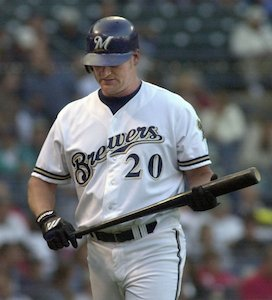

% Visualizing and Modeling Baseball Hall of Fame Voting
% Kenny Shirley
% August 19, 2014


# Collaborators
Joint work with Carlos Scheidegger and Carson Sievert

# About Me
- Long-time (~ 10 years) sports statistics researcher/hobbyist
- Undergrad thesis on the Markov model for baseball
- In statistics grad school, co-authored "Bayesball", a relatively early (Bayesian) model for fielding that used location information about all batted balls.
    - Our method was called SAFE = Spatial Aggregate Fielding Evaluation (Annals of Applied Statistics, 2009)
- I've also dabbled with some basketball and football statistics...

# Today's Outline
 - Baseball Hall of Fame voting is awful
 - But... if you can't beat 'em, join 'em
 - Visualize the data
 - Model the outcome

# Introduction

# Baseball HOF fame voting is awful

# First, the rules:

A player can appear on the ballot after having played for at least 10 years and having been retired for at least 5 years.

# First, the rules:

A committee chooses who appears on the ballot, and they are... "generous"

# First, the rules:
A committee chooses who appears on the ballot.

They are... "generous"


Jeff Cirillo, 3B, 1994 - 2007: .296 BA, 112 HR, 32 WAR, 2 All-Star Teams

# First, the rules:
A committee chooses who appears on the ballot.

They are... "generous"


Jeromy Burnitz, OF, 1993 - 2006: .253 BA, 315 HR, 17.4 WAR, 1 All-Star Team

# First, the rules:
A committee chooses who appears on the ballot.

They are... "generous"


Dan Plesac, P, 1986 - 2003: 65 - 71 Win-Loss, 3.64 ERA, 17.2 WAR, 3 All-Star Teams

# More Rules:

3. About 570 members of the Baseball Writers Association of America vote each year in December, with results announced in January
4. You must appear on at least 75% of the ballots to be elected
5. Sometime in the 1960s they started to enforce the rule that if you appear on less than 5% of ballots, you are permanently removed from future ballots.
6. A player may appear on a maximum of 15 ballots (i.e. consecutive years) before being permanently removed.


# Statistics (how many years it takes, how many have been inducted)

# Major problems

# Part 1: Visualize the data

# Getting the data

# A few plots in R

# Using d3 (examples? gallery?)

# Two main parts of the visualization
- Plot of voting % vs. year
- histograms for each statistical category

# Demo

# Part 2: Model the data and make predictions

# What have others done?
- JAWS
- Bill James
- Michael Freiman's paper in JQAS a few years back...

# Back to the data: what predictors should we use?

# A simple model: lay out the equation

# Show the R code to do logistic regression

# Show results of the regression

# Show the residuals

# Model 2 additional variables

# Model 2 residuals

# Model 3 additional variables

# Model 3 residuals

# 2014 results

# 2015 predictions


# Additional templates

```r
qplot(speed, dist, data = cars) + geom_smooth()
```


# Last Slide

I just added this as a test:

```r
plot(rnorm(100), rnorm(100), pch=19, col=sample(c(2, 3, 4), 100, replace=TRUE))
```


